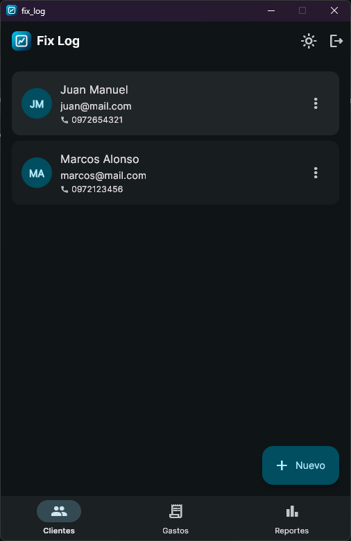
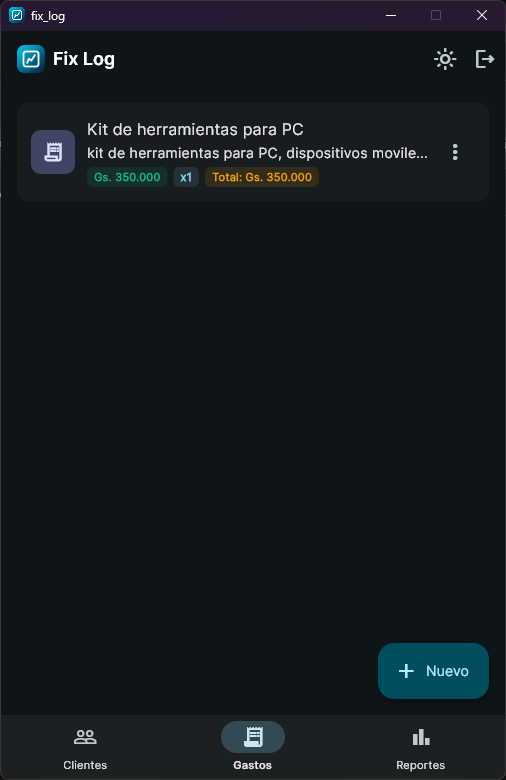
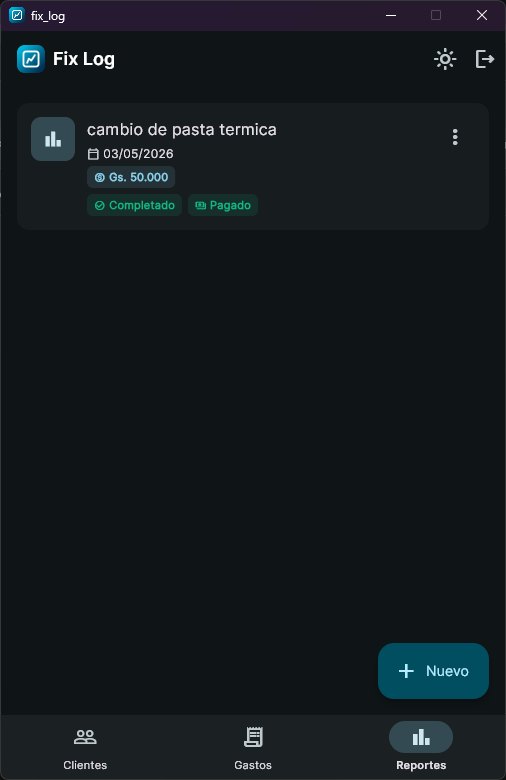
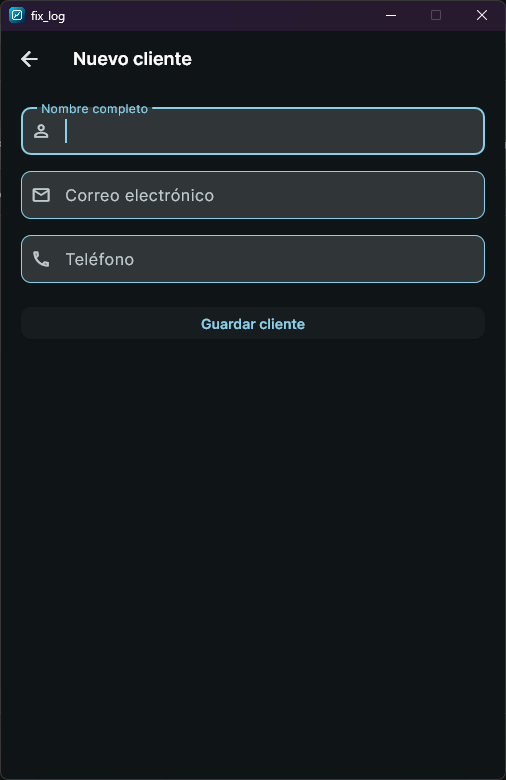
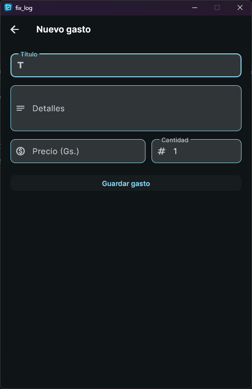
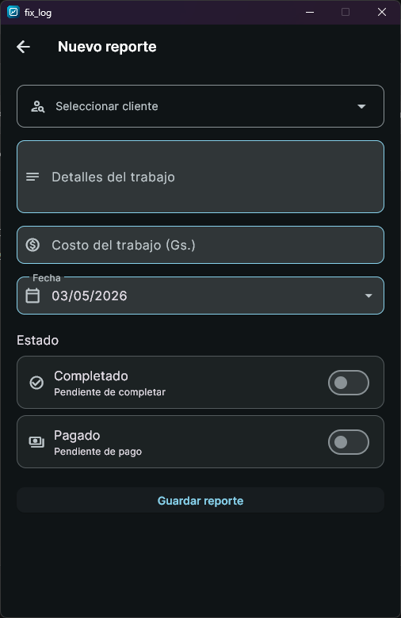
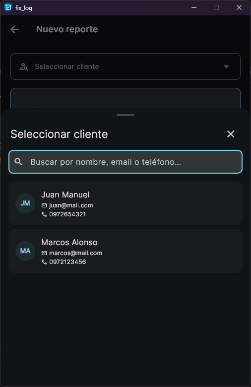

# fix_log

Aplicación de gestión para técnicos y prestadores de servicios. Permite registrar clientes, reportes de trabajo y gastos operativos, con datos completamente aislados por usuario.

## Screenshots

<table>
  <tr>
    <td align="center"><b>Clientes</b></td>
    <td align="center"><b>Gastos</b></td>
    <td align="center"><b>Reportes</b></td>
  </tr>
  <tr>
    <td></td>
    <td></td>
    <td></td>
  </tr>
  <tr>
    <td align="center"><b>Nuevo cliente</b></td>
    <td align="center"><b>Nuevo gasto</b></td>
    <td align="center"><b>Nuevo reporte</b></td>
  </tr>
  <tr>
    <td></td>
    <td></td>
    <td></td>
  </tr>
  <tr>
    <td align="center" colspan="3"><b>Selector de cliente con búsqueda</b></td>
  </tr>
  <tr>
    <td colspan="3" align="center"></td>
  </tr>
</table>

## Stack

| Capa     | Tecnología                           |
| -------- | ------------------------------------ |
| Backend  | ASP.NET Core 10, EF Core, PostgreSQL |
| Frontend | Flutter 3, Provider                  |
| Auth     | JWT + BCrypt                         |
| Docs     | Scalar UI                            |

## Funcionalidades

- Registro e inicio de sesión con JWT
- CRUD de clientes con historial de reportes asociados
- CRUD de reportes con estado de completado y pago, costo y fecha
- CRUD de gastos operativos con precio unitario y cantidad
- Modo oscuro / claro
- Datos completamente aislados por usuario
- Tamaño de ventana limitado en Windows y Linux

## Estructura del proyecto

```text
fix-log/
├── assets/          # Screenshots del README
├── fix-log-api/     # Backend ASP.NET Core
└── fix_log/         # App Flutter (Windows / Linux / Android / iOS)
```

## Levantar el proyecto

### Backend

**Requisitos:** .NET 10 SDK, PostgreSQL, `dotnet-ef`

```bash
# 1. Base de datos (con Docker)
docker run --name postgres -e POSTGRES_PASSWORD=admin -p 5432:5432 -d postgres:16

# 2. Aplicar migraciones
cd fix-log-api
dotnet ef database update

# 3. Correr la API
dotnet run
```

La API queda disponible en `http://localhost:5167`.  
La documentación interactiva (Scalar) en `http://localhost:5167/scalar/v1`.

> Configurá el JWT Secret en `appsettings.json` con una clave de al menos 32 caracteres.

### Frontend

**Requisitos:** Flutter 3.x SDK

```bash
cd fix_log
flutter pub get
flutter run
```

Para apuntar a una API en otro host:

```bash
flutter run --dart-define=API_BASE_URL=http://192.168.x.x:5167/api
```

> En emulador Android la app usa `10.0.2.2` por defecto para alcanzar `localhost` del host.

## Endpoints

| Método              | Ruta                 | Auth |
| ------------------- | -------------------- | ---- |
| POST                | `/api/auth/register` | No   |
| POST                | `/api/auth/login`    | No   |
| GET/POST/PUT/DELETE | `/api/customer`      | Sí   |
| GET/POST/PUT/DELETE | `/api/expense`       | Sí   |
| GET/POST/PUT/DELETE | `/api/report`        | Sí   |

Todos los endpoints protegidos requieren `Authorization: Bearer <token>`.
